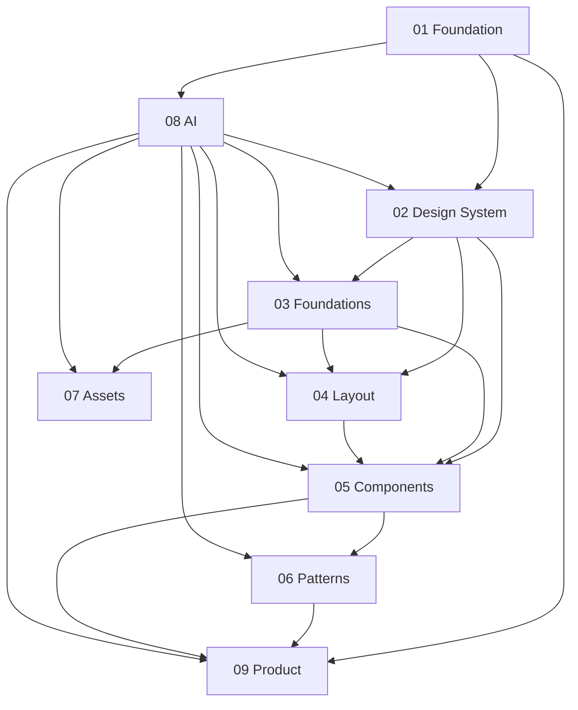

# PlayBooky Design Operating System Document Map

| Field | Value |
| --- | --- |
| Status | Current |
| Confidence | 5 Production ready |
| Version | 1.0.0 |
| Owner | Design System |
| Last updated | 2026-07-07 |

## Purpose

This document is the master index for the PlayBooky Design Operating System.

It defines how documentation is organised, how documents depend on each other, which sources have authority when guidance conflicts, and how humans and AI agents should move through the system without guessing.

All documentation work should start here unless a task points to a more specific source-of-truth document.

## Documentation Hierarchy

The PlayBooky documentation set is organised from governing intent to implementation detail.

| Level | Folder | Purpose | Primary audience |
| --- | --- | --- | --- |
| 1 | `docs/01-foundation/` | Governing rules, principles, document map, and AI behaviour. | Humans and AI agents |
| 2 | `docs/02-design-system/` | Design Portal structure, documentation standards, navigation, and page templates. | Design system contributors |
| 3 | `docs/03-foundations/` | Visual and interaction foundations such as colour, typography, spacing, motion tokens, breakpoints, radius, and elevation. | Designers, engineers, AI agents |
| 4 | `docs/04-layout/` | Layout primitives and page composition rules. | Designers and engineers |
| 5 | `docs/05-components/` | Component category documentation and future component specifications. | Designers, engineers, reviewers |
| 6 | `docs/06-patterns/` | Reusable product and interaction patterns. | Product, design, engineering |
| 7 | `docs/07-assets/` | Logos, icons, illustrations, and asset usage rules. | Design and implementation contributors |
| 8 | `docs/08-ai/` | AI build rules, quality gates, and review process. | AI agents and reviewers |
| 9 | `docs/09-product/` | Product vision, roadmap, and product-specific direction. | Product and strategy contributors |

Folder `README.md` files introduce each documentation area. Detailed documents inside each folder provide the source-of-truth rules for that area.

## Current Document Index

| Document | Role |
| --- | --- |
| `docs/README.md` | Top-level documentation entry point. |
| `docs/01-foundation/README.md` | Foundation area overview. |
| `docs/01-foundation/document-map.md` | Master index and navigation point for the full operating system. |
| `docs/01-foundation/constitution.md` | Highest-authority operating rules for PlayBooky V3. |
| `docs/01-foundation/principles.md` | Product and design principles that guide decisions. |
| `docs/01-foundation/ai-behaviour.md` | Expected AI agent behaviour in the repository. |
| `docs/02-design-system/README.md` | Design system area overview. |
| `docs/02-design-system/documentation-standards.md` | Documentation maintenance, naming, freshness, and cross-linking standards. |
| `docs/02-design-system/information-architecture.md` | Design Portal information architecture. |
| `docs/02-design-system/navigation.md` | Design Portal navigation structure. |
| `docs/02-design-system/page-template.md` | Required component page specification. |
| `docs/03-foundations/README.md` | Foundations area overview. |
| `docs/03-foundations/breakpoints.md` | Breakpoint and responsive rules. |
| `docs/03-foundations/colours.md` | Colour system and usage rules. |
| `docs/03-foundations/elevation.md` | Elevation scale and layering guidance. |
| `docs/03-foundations/motion-tokens.md` | Motion token rules. |
| `docs/03-foundations/radius.md` | Border radius scale and usage. |
| `docs/03-foundations/spacing.md` | Spacing scale and usage. |
| `docs/03-foundations/typography.md` | Typography system and text rules. |
| `docs/04-layout/README.md` | Layout area overview. |
| `docs/04-layout/container.md` | Container rules. |
| `docs/04-layout/grid.md` | Grid rules. |
| `docs/04-layout/page.md` | Page layout rules. |
| `docs/04-layout/section.md` | Section layout rules. |
| `docs/04-layout/stack.md` | Stack layout rules. |
| `docs/04-layout/surface.md` | Surface rules. |
| `docs/05-components/README.md` | Component area overview. |
| `docs/05-components/feedback/README.md` | Feedback component category. |
| `docs/05-components/forms/README.md` | Form component category. |
| `docs/05-components/navigation/README.md` | Navigation component category. |
| `docs/05-components/product/README.md` | Product component category. |
| `docs/05-components/ui/README.md` | UI component category. |
| `docs/06-patterns/README.md` | Pattern area overview. |
| `docs/06-patterns/builder.md` | Builder pattern rules. |
| `docs/06-patterns/diagnosis.md` | Diagnosis pattern rules. |
| `docs/06-patterns/facilitator-guide.md` | Facilitator guide pattern rules. |
| `docs/06-patterns/recommendation.md` | Recommendation pattern rules. |
| `docs/07-assets/README.md` | Asset area overview. |
| `docs/07-assets/icons.md` | Icon usage and governance. |
| `docs/07-assets/illustrations.md` | Illustration usage and governance. |
| `docs/07-assets/logos.md` | Logo usage and governance. |
| `docs/08-ai/README.md` | AI area overview. |
| `docs/08-ai/build-rules.md` | AI build rules. |
| `docs/08-ai/quality-gate.md` | AI quality gate rules. |
| `docs/08-ai/review-process.md` | AI review process rules. |
| `docs/09-product/README.md` | Product area overview. |
| `docs/09-product/roadmap.md` | Product roadmap direction. |
| `docs/09-product/vision.md` | Product vision direction. |

## Dependency Graph

The documentation dependency graph flows from authority to implementation detail:

Dependency rules:

- Foundation documents govern every other documentation area.
- Design system operating documents govern portal structure, page structure, and component documentation.
- Foundation tokens govern layout, components, patterns, and assets.
- Layout primitives govern component and product page composition.
- Components and patterns govern product-facing interface decisions.
- AI rules govern how agents interpret, validate, and change every documentation area.
- Product documents guide product intent but must not override foundation or design system governance.

## Reading Order For Humans

Humans should read documentation in this order when onboarding to the PlayBooky Design Operating System:

1. `docs/01-foundation/document-map.md`
2. `docs/01-foundation/constitution.md`
3. `docs/01-foundation/principles.md`
4. `docs/02-design-system/documentation-standards.md`
5. `docs/02-design-system/information-architecture.md`
6. `docs/02-design-system/navigation.md`
7. `docs/02-design-system/page-template.md`
8. `docs/03-foundations/README.md`
9. `docs/04-layout/README.md`
10. `docs/05-components/README.md`
11. `docs/06-patterns/README.md`
12. `docs/08-ai/quality-gate.md`
13. `docs/09-product/vision.md`
14. `docs/09-product/roadmap.md`

Task-specific reading:

- For a component task, read the constitution, page template, relevant foundation token documents, relevant layout documents, component category README, and related pattern documents.
- For a layout task, read the constitution, relevant foundation token documents, and the relevant layout primitive.
- For a pattern task, read the constitution, related component documentation, relevant layout documents, and the pattern document.
- For an AI-agent task, read the constitution, this document map, `docs/01-foundation/ai-behaviour.md`, and the relevant documents for the requested area.

## Reading Order For AI

AI agents must read from authority to task detail.

Required baseline order:

1. `docs/01-foundation/document-map.md`
2. `docs/01-foundation/constitution.md`
3. `docs/01-foundation/ai-behaviour.md`
4. `docs/08-ai/build-rules.md`
5. `docs/08-ai/quality-gate.md`
6. The specific source-of-truth documents for the task area.
7. The files or implementation surfaces being changed.

AI agents must stop and flag missing context when:

- A requested change conflicts with the constitution.
- A requested implementation lacks purpose, user need, or success criteria.
- A component lacks the required component page sections.
- A token, layout primitive, component, pattern, or product rule is implied but undocumented.
- A document has no status, owner, or last-updated metadata where metadata is required.

AI agents must not:

- Treat code as more authoritative than approved documentation.
- Invent undocumented variants, states, tokens, behaviours, or product rules.
- Use a lower-authority document to override a higher-authority document.
- Modify existing documents when the user explicitly asks for a new document only.

## Authority Hierarchy

When documents, portal pages, implementation, or task instructions conflict, use this hierarchy:

1. `docs/01-foundation/constitution.md`
2. Approved or Current Design Portal pages
3. Foundation documents in `docs/01-foundation/`
4. Design system operating documents in `docs/02-design-system/`
5. Foundation token documents in `docs/03-foundations/`
6. Layout documents in `docs/04-layout/`
7. Component documents in `docs/05-components/`
8. Pattern documents in `docs/06-patterns/`
9. Asset documents in `docs/07-assets/`
10. AI operating documents in `docs/08-ai/`, for agent behaviour and review process
11. Product documents in `docs/09-product/`
12. Existing shared implementation
13. Existing product implementation
14. Current task instructions
15. AI inference

Conflict rules:

- The constitution wins over every other source unless the task explicitly asks to amend the constitution.
- Current Design Portal decisions win over Approved decisions.
- Approved and Current decisions win over Exploring, Improved, Rejected, or Deprecated decisions.
- More specific documents win only when they do not contradict higher-authority governance.
- AI inference is allowed only to connect documented rules, never to create new rules.

## Cross-Reference Rules

Documentation must be connected enough for a reader to navigate without private context.

Rules:

- Every document must link to its parent area README when practical.
- Every detailed document should link to directly related documents.
- Component documents must link to related foundation tokens, layout rules, patterns, and related components.
- Pattern documents must link to the components and layout primitives they depend on.
- Asset documents must link to usage rules when assets are used by components or patterns.
- AI documents must link to the quality gates or source-of-truth documents they enforce.
- Product documents must link to relevant patterns, components, or governance documents when they define implementation-facing direction.

Cross-reference quality rules:

- Links must point to existing documents.
- Link text must name the target concept, not use generic text such as `here`.
- Circular references are allowed only when each document has a distinct role.
- A cross-reference must not be used as a substitute for required local content when a document must be self-contained.
- If a document intentionally has no related documents, state `No related documents documented`.

## Required Document Metadata

Every governed document should include metadata near the top of the page.

Required metadata:

| Field | Required | Rule |
| --- | --- | --- |
| Status | Yes | Must use the canonical lifecycle status model. |
| Confidence | Yes | Must use the canonical confidence scale when the document guides implementation. |
| Version | Yes | Must use semantic versioning. |
| Owner | Yes | Must name the accountable role, team, or person. |
| Last updated | Yes | Must use ISO date format: `YYYY-MM-DD`. |

Canonical status values:

- Exploring
- Improved
- Approved
- Current
- Rejected
- Deprecated

Canonical confidence values:

- 1 Experimental
- 2 Prototype
- 3 Visually directional
- 4 Usability ready
- 5 Production ready

Metadata validation rules:

- Metadata values must not be blank.
- `Owner` must not be `Unknown` or `TBD`.
- `Last updated` must change when document content changes.
- `Version` must change when rules, contracts, source-of-truth status, or acceptance criteria change.
- Documents with status `Approved` or `Current` must have confidence `4 Usability ready` or `5 Production ready` unless a documented exception exists.

## Document Lifecycle

Documents follow the canonical lifecycle status model.

| Status | Meaning | Allowed next statuses |
| --- | --- | --- |
| Exploring | The document is early, unresolved, or used to shape direction. | Improved, Rejected |
| Improved | The document has been revised and is ready for review. | Approved, Exploring, Rejected |
| Approved | The document has passed review and may guide work. | Current, Improved, Deprecated |
| Current | The document is the active source of truth. | Improved, Deprecated |
| Rejected | The document or direction must not guide implementation. | Exploring |
| Deprecated | The document is retained for reference but must not guide new work. | Current only through explicit reapproval |

Lifecycle rules:

- A document cannot become `Approved` or `Current` without purpose, scope, owner, validation rules, and acceptance expectations.
- A document that guides implementation must include AI behaviour rules or link to the AI behaviour rules that apply.
- A document that changes source-of-truth rules must update version and last-updated metadata.
- Deprecated documents must identify the replacement document when one exists.
- Rejected documents must explain why the direction was rejected.

## Future Documentation Roadmap

The documentation system should evolve toward complete source-of-truth coverage for product and implementation decisions.

Near-term roadmap:

- Add metadata to every governed document.
- Expand placeholder documents into complete specifications.
- Add component pages for each approved component.
- Add status, confidence, owner, and last-updated fields to all component category pages.
- Link foundation tokens to implementation variables when available.

Medium-term roadmap:

- Add decision history to foundation, layout, component, pattern, and AI documents.
- Create a formal review record for Approved and Current documents.
- Add examples and anti-examples for all component and pattern documents.
- Add migration notes for Deprecated or replaced documents.
- Add machine-readable indexes for component, pattern, token, and asset documentation.

Long-term roadmap:

- Keep the Design Portal and documentation synchronized.
- Add automated validation for required metadata, broken links, lifecycle statuses, and component page sections.
- Add documentation freshness checks based on last-updated dates and implementation changes.
- Add product surface maps that show where each component and pattern is used.
- Add release notes for design operating system changes.

## Validation Rules

Documentation validation must check structure, authority, references, and implementation readiness.

Global validation rules:

- Every governed document must have a clear purpose.
- Every governed document must identify its scope.
- Every governed document must include or inherit metadata.
- Every governed document must use canonical status values.
- Every implementation-facing document must define validation rules or link to validation rules.
- Every component page must follow `docs/02-design-system/page-template.md`.
- Every link must resolve to an existing file or documented external source.
- Every required section must contain useful content or an explicit `Not applicable` reason.
- Documents must not contradict higher-authority documents.
- Documents must not define implementation-ready work without purpose, user need, and success criteria.

AI validation rules:

- AI agents must check this document before deciding which documents to read.
- AI agents must read the highest-authority applicable document before making implementation-facing changes.
- AI agents must report missing required metadata.
- AI agents must report broken or missing cross-references when they affect the task.
- AI agents must not silently fill gaps with inferred rules.

## Documentation Quality Checklist

Use this checklist before approving or relying on a document:

- [ ] The document has a clear purpose.
- [ ] The document has a defined scope.
- [ ] Required metadata is present and valid.
- [ ] The document follows the correct place in the hierarchy.
- [ ] The document does not conflict with the constitution.
- [ ] The document links to necessary parent, dependency, and related documents.
- [ ] Cross-references point to existing documents.
- [ ] Status and confidence match the document's readiness.
- [ ] Validation rules are testable.
- [ ] AI behaviour is explicit or linked to a governing AI document.
- [ ] Required sections are present.
- [ ] `Not applicable` sections include a reason.
- [ ] Examples use realistic PlayBooky context where examples are needed.
- [ ] Deprecated or rejected content is clearly labelled.
- [ ] Future work is separated from current source-of-truth guidance.
- [ ] The document can be used by a human without private context.
- [ ] The document can be used by an AI agent without inventing missing rules.

## Acceptance Criteria

This document is complete when:

- It can serve as the single navigation point for all documentation.
- It identifies the purpose and hierarchy of all documentation areas.
- It defines dependency, authority, lifecycle, and validation rules.
- It provides separate reading orders for humans and AI agents.
- It defines required metadata for governed documents.
- It gives contributors a clear documentation quality checklist.
- It does not modify or replace the authority of the constitution.
